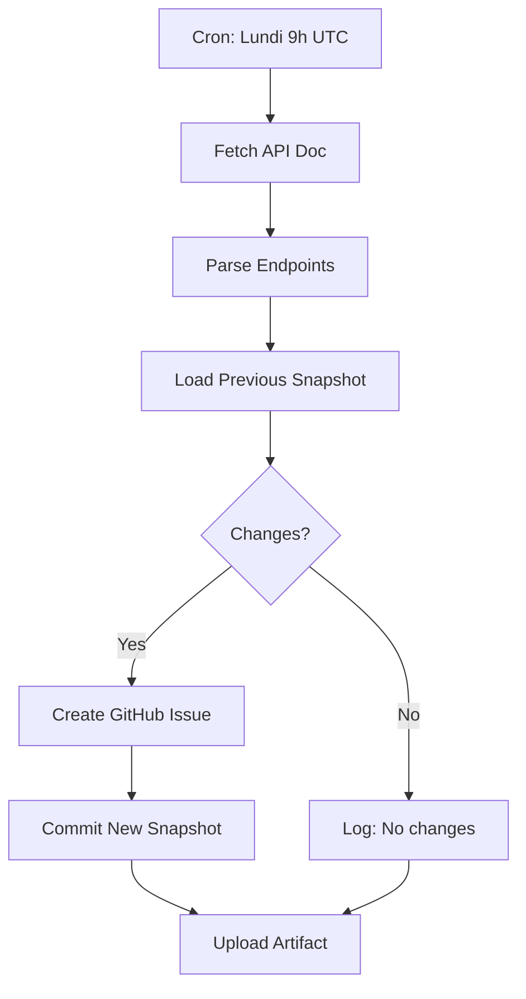

# 🎯 Système de Surveillance API BoondManager - Résumé d'Installation

## 📋 Vue d'ensemble

Système automatique de surveillance hebdomadaire de l'API BoondManager qui détecte les changements dans la documentation officielle et crée des issues GitHub pour faciliter la maintenance.

**Date d'installation**: 2026-04-26  
**Status**: ✅ Prêt à déployer

---

## 📁 Fichiers Créés

### 1. Workflow Principal
**`.github/workflows/api-monitor.yml`** — 350+ lignes
- Cron: Tous les lundis à 9h00 UTC
- Scraping de `https://doc.boondmanager.com/api-externe/raml-build/`
- Détection automatique des changements (ajouts/suppressions/modifications)
- Création d'issues GitHub avec détails complets
- Commit automatique du snapshot mis à jour
- Upload d'artifacts pour audit

### 2. Workflow de Test
**`.github/workflows/api-monitor.test.yml`** — 60 lignes
- Test de l'accessibilité de l'API BoondManager
- Validation de la syntaxe YAML
- Installation des dépendances (axios, cheerio, diff)
- Exécution manuelle uniquement (sécurité)

### 3. Snapshot Initial
**`.github/api-snapshot.json`** — Baseline vide
```json
{
  "timestamp": "2026-04-26T00:00:00.000Z",
  "url": "https://doc.boondmanager.com/api-externe/raml-build/",
  "endpointsCount": 0,
  "endpoints": []
}
```
Sera automatiquement rempli lors de la première exécution.

### 4. Documentation Complète
**`.github/API_MONITORING.md`** — 200+ lignes
- Fonctionnement détaillé du système
- Configuration du cron
- Structure du snapshot
- Checklist d'actions recommandées
- Troubleshooting complet
- Évolutions futures

### 5. README GitHub Actions
**`.github/README.md`** — 300+ lignes
- Vue d'ensemble de tous les workflows
- Documentation des artifacts
- Guide de déploiement et maintenance
- Troubleshooting centralisé
- Références et ressources

### 6. Script de Test Local
**`scripts/test-api-monitor.js`** — 200+ lignes
- Test en local sans GitHub Actions
- Pas de dépendances externes (Node.js natif + https)
- Mode dry-run et mode save
- Interface CLI conviviale

### 7. Template d'Issue
**`.github/ISSUE_TEMPLATE/api-update.yml`** — 100+ lignes
- Template structuré pour les issues d'API update
- Champs: résumé, checklist, priorité, impact
- Labels automatiques: `enhancement`, `api-update`, `automated`

### 8. Package.json Scripts
```json
{
  "scripts": {
    "api:monitor:test": "node scripts/test-api-monitor.js",
    "api:monitor:save": "node scripts/test-api-monitor.js --save"
  }
}
```

### 9. .gitignore Mis à Jour
Exclusions ajoutées:
- `changes.json`
- `issue-body.md`

### 10. CLAUDE.md Mis à Jour
Section CI/CD enrichie avec documentation du workflow API Monitor.

---

## 🚀 Utilisation

### Déclenchement Automatique
Le workflow s'exécute **automatiquement tous les lundis à 9h00 UTC**. Aucune action requise.

### Déclenchement Manuel
```bash
# Via GitHub Actions UI
Actions → "Monitor BoondManager API Changes" → "Run workflow"
```

### Test Local (avant commit)
```bash
# Test en lecture seule
npm run api:monitor:test

# Test + sauvegarde du snapshot
npm run api:monitor:save
```

---

## 🔄 Workflow



---

## 📊 Issue Créée (Exemple)

Quand des changements sont détectés, une issue est automatiquement créée:

**Titre**: `[API] Nouveautés détectées dans BoondManager API (2026-04-26)`  
**Labels**: `enhancement`, `api-update`, `automated`

**Contenu**:
- ➕ Liste des nouveaux endpoints (méthode + path)
- ➖ Liste des endpoints supprimés
- 🔄 Liste des endpoints modifiés
- 📋 Checklist d'actions recommandées:
  - [ ] Examiner la documentation officielle
  - [ ] Mettre à jour les schémas Zod
  - [ ] Ajouter/modifier les outils
  - [ ] Mettre à jour les tests
  - [ ] Regénérer `TOOLS.md`
  - [ ] Documenter dans `CHANGELOG.md`

---

## ✅ Checklist de Déploiement

### Pré-déploiement
- [x] Tous les fichiers créés et commités
- [ ] Tester localement: `npm run api:monitor:test`
- [ ] Vérifier la syntaxe YAML: Actions → "Test API Monitor Workflow" → "Run workflow"
- [ ] Confirmer les permissions GitHub (`contents: write`, `issues: write`)

### Déploiement
- [ ] Pousser les fichiers vers `main`
- [ ] Vérifier que le workflow apparaît dans Actions
- [ ] Déclencher manuellement la première fois
- [ ] Vérifier qu'un snapshot initial est créé
- [ ] Confirmer qu'aucune issue n'est créée (première exécution = baseline)

### Post-déploiement
- [ ] Attendre l'exécution automatique suivante (lundi prochain)
- [ ] Vérifier qu'une issue est créée si changements
- [ ] Tester le cycle complet: issue → fix → PR → merge
- [ ] Documenter les éventuels ajustements nécessaires

---

## 🎛️ Configuration

### Modifier la Fréquence

Dans `.github/workflows/api-monitor.yml`:

```yaml
on:
  schedule:
    - cron: '0 9 * * 1'  # minute heure jour-mois mois jour-semaine
```

**Exemples**:
- `0 9 * * 1` : Lundi 9h (défaut)
- `0 14 * * 3` : Mercredi 14h
- `0 6 1 * *` : 1er du mois 6h
- `0 */12 * * *` : Toutes les 12h

### Personnaliser les Labels

Dans le script Node.js de `.github/workflows/api-monitor.yml`:

```javascript
execSync(`gh issue create --title "${title}" --body-file issue-body.md --label enhancement,api-update,YOUR_LABEL`, {
  stdio: 'inherit'
});
```

### Ajouter des Notifications

Slack, Discord, Email, etc. — Ajouter un step après "Create GitHub issue":

```yaml
- name: Notify Slack
  if: success()
  uses: slackapi/slack-github-action@v1
  with:
    webhook-url: ${{ secrets.SLACK_WEBHOOK }}
    payload: |
      {"text": "🔔 Nouveautés détectées dans BoondManager API!"}
```

---

## 🐛 Troubleshooting Rapide

| Symptôme | Cause Probable | Solution |
|----------|---------------|----------|
| Workflow ne s'exécute pas | Cron désactivé | Vérifier Actions → "Monitor..." → Enabled |
| Issue non créée | Permissions manquantes | Ajouter `contents: write` + `issues: write` |
| Faux positifs | Comparaison trop sensible | Ajuster logique JSON.stringify → normalisation |
| Rate limit / 403 | Protection anti-bot | User-Agent ajouté; GitHub Actions OK |
| Snapshot conflict | PRs concurrentes | Accepter version la plus récente (timestamp) |

---

## 📚 Références Clés

- **Documentation BoondManager**: https://doc.boondmanager.com/api-externe/raml-build/
- **Blog GitHub (Workflows Testing)**: https://github.github.com/gh-aw/blog/2026-01-13-meet-the-workflows-testing-validation/
- **GitHub Actions Events**: https://docs.github.com/en/actions/using-workflows/events-that-trigger-workflows
- **GitHub CLI**: https://cli.github.com/manual/gh_issue_create

---

## 🔮 Évolutions Futures

### Court Terme (1-3 mois)
- [ ] Affiner la détection (ignorer changements mineurs)
- [ ] Ajouter métriques (nombre de changements/mois)
- [ ] Créer des labels de priorité automatiques (breaking vs. enhancement)

### Moyen Terme (3-6 mois)
- [ ] Parsing RAML approfondi (types, paramètres, exemples)
- [ ] Génération automatique de stubs de code pour nouveaux endpoints
- [ ] Intégration Slack/Discord pour notifications temps-réel

### Long Terme (6-12 mois)
- [ ] Détection de breaking changes (endpoints supprimés, paramètres requis)
- [ ] Génération automatique de PRs avec implémentation partielle
- [ ] Dashboard de métriques (Grafana, Prometheus)
- [ ] Versioning automatique basé sur changements API (semver)

---

## 👥 Maintenance

**Responsable**: @fauguste  
**Fréquence de révision**: Mensuelle  
**Canaux de support**:
- Issues GitHub avec label `api-monitor`
- Documentation: `.github/API_MONITORING.md`

---

## 📝 Changelog du Monitoring

### v1.0.0 (2026-04-26) — Initial Release
- ✅ Workflow hebdomadaire automatique
- ✅ Détection ajouts/suppressions/modifications
- ✅ Création d'issues GitHub
- ✅ Snapshot versionné Git
- ✅ Tests locaux + workflow test
- ✅ Documentation complète

---

**🎉 Le système est prêt à être déployé !**

Pour démarrer:
```bash
# 1. Tester localement
npm run api:monitor:test

# 2. Commit + push
git add .
git commit -m "feat: add BoondManager API monitoring workflow"
git push

# 3. Déclencher manuellement (première fois)
# GitHub → Actions → "Monitor BoondManager API Changes" → "Run workflow"

# 4. Attendre le premier cron automatique (lundi prochain 9h)
```

Bonne surveillance ! 🚀
